# Hierarchical Cooperative Motion Planning for Nonholonomic Multi-UGV Vehicular Systems

## Centralized Spatiotemporal Coordination and Distributed Local Planning

This repository provides supplementary experimental materials for the paper **“Hierarchical Cooperative Motion Planning for Nonholonomic Multi-UGV Vehicular Systems: Centralized Spatiotemporal Coordination and Distributed Local Planning.”** It complements the experimental section of the paper with layer-wise simulation demonstrations, additional parameter settings, quantitative comparisons, an ablation study of MP-EPBS, per-UGV collision-constraint slack statistics, and real-vehicle videos and trajectory results.

Cooperative motion planning for nonholonomic multi-UGV vehicular systems remains challenging because dense inter-vehicle conflicts must be resolved under vehicle kinematic limits and restricted onboard computation. The proposed centralized–distributed hierarchical framework decomposes the coupled planning problem into three connected layers:

1. **Centralized global path coordination:** vehicle-feasible motion primitives are integrated with an enhanced priority-based search framework to resolve spatial path conflicts.
2. **Centralized global velocity coordination:** Type-I and Type-II conflict zones are formulated in the spatial domain, and binary-free log-sum-exp approximations are used to coordinate vehicle passing orders and velocity profiles.
3. **Reference-guided distributed local motion planning:** each UGV independently replans over a receding horizon using globally coordinated spatiotemporal references, convex safe spaces, and a constraint-relaxed SQP solver.

The simulation evaluation contains three representative scenarios: **Random-Obstacle**, **Intersection**, and **Narrow-Channel**. Statistical results are averaged over 50 randomized trials per scenario, while the GIFs and plotted profiles show representative runs. The simulation materials below follow the same three-layer organization as the paper. Real-vehicle experiments are presented separately in Section 2.

---

# 1. Simulation Experiments

## 1.1 Centralized Global Path Coordination

The global path layer uses an offline motion-primitive library and the proposed motion-primitive-enhanced priority-based search method, MP-EPBS, to generate vehicle-feasible paths and resolve spatial conflicts among UGVs. The three GIFs below show representative planning results in the Random-Obstacle, Intersection, and Narrow-Channel scenarios.

For collision checking, static obstacles are inflated outward by 0.08 m. Each UGV footprint is additionally enlarged by 0.05 m in the longitudinal direction and 0.04 m in the lateral direction. These conservative geometric margins provide additional clearance between UGVs and obstacles.

### Parameter Settings

**Table 1. Parameter settings for global path coordination.**

| Symbol | Description | Value |
|---|---|---:|
| `L_w` | Wheelbase | 2.78 m |
| `L_b` | Vehicle width | 1.85 m |
| `L_f` | Front overhang | 0.915 m |
| `L_r` | Rear overhang | 0.915 m |
| `n_mp` | Number of samples per motion primitive | 7 |
| `k_mp` | Duration of each motion primitive | 2.5 s |
| `K_mp` | Number of candidate motion primitives | 10 |
| `w` | FOCAL suboptimality factor | 1.05 |
| `w_pp` | Obstacle-aware heuristic weight | 1.4 |
| `v_ref` | Reference velocity | 4 m/s |
| `a_max` | Maximum longitudinal acceleration | 3 m/s² |
| `delta_max` | Maximum steering angle | 30° |
| `alpha_max` | Maximum steering rate | 30°/s |

### Global Path Coordination Demonstrations

<table>
<tr>
<td align="center" width="33%">
<br>
<b>Random-Obstacle Scenario</b><br>
Twelve UGVs perform multi-directional traversal in an obstacle-rich environment.
</td>
<td align="center" width="33%">
<br>
<b>Intersection Scenario</b><br>
Six UGVs resolve crossing and merging conflicts at a structured intersection.
</td>
<td align="center" width="33%">
<br>
<b>Narrow-Channel Scenario</b><br>
Six UGVs coordinate bidirectional traversal through a constrained passage.
</td>
</tr>
</table>

The GIFs visualize the spatial conflict-resolution process of MP-EPBS. The generated paths satisfy the nonholonomic vehicle constraints and provide the geometric references required by the subsequent global velocity-coordination layer.

### Velocity Profiles Associated With the Global Paths

The following plots show the velocity information obtained together with the global path-planning results. They are presented as outputs of the path layer rather than as direct before-and-after comparisons with the coordinated velocities in Section 1.2.

<table>
<tr>
<td align="center" width="20%">
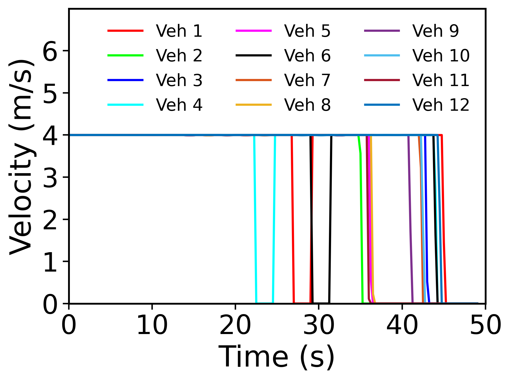<br>
<b>Random-Obstacle</b>
</td>
<td align="center" width="20%">
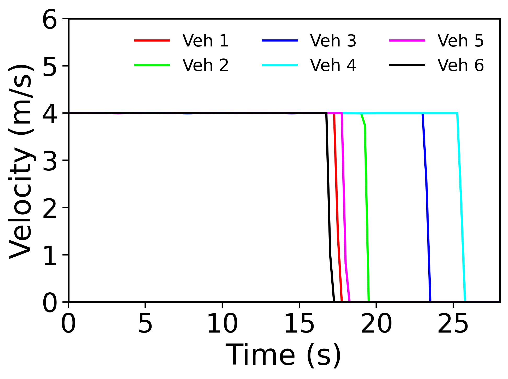<br>
<b>Intersection</b>
</td>
<td align="center" width="20%">
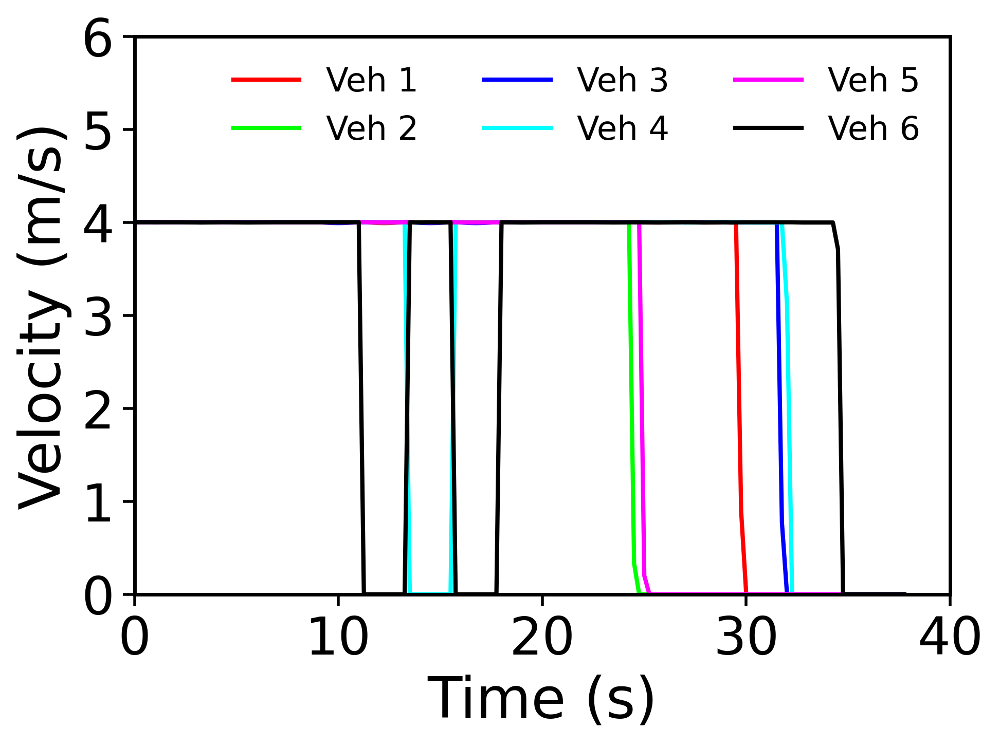<br>
<b>Narrow-Channel</b>
</td>
</tr>
</table>

These profiles characterize the temporal information associated with the vehicle-feasible global paths before conflict-zone-based velocity coordination is applied.

### Quantitative Comparison With Global Path-Planning Baselines

The proposed global path layer is compared with MP-PBS, MP-ECBS, and MP-CBS over 50 randomized trials per scenario.

**Comparison of global path coordination results across three scenarios.**

| Scenario | Algorithm | Success Rate (%) | Avg. Computation Time (s) | Avg. High-Level Node Expansions | Avg. Low-Level Planner Calls | Avg. Path Cost |
|---|---|---:|---:|---:|---:|---:|
| Random-Obstacle | **Proposed (Global Path Layer)** | **100** | **2.68** | **6.24** | **17.66** | 2282.38 |
| Random-Obstacle | MP-PBS | **100** | 8.80 | 31.24 | 48.76 | 2239.46 |
| Random-Obstacle | MP-ECBS | **100** | 4.54 | 17.60 | 28.60 | 2273.65 |
| Random-Obstacle | MP-CBS | 76 | 24.63 | 152.95 | 163.95 | **2235.16** |
| Intersection | **Proposed (Global Path Layer)** | **100** | **0.44** | **2.66** | **7.66** | 569.49 |
| Intersection | MP-PBS | **100** | 0.73 | 7.32 | 12.52 | **561.62** |
| Intersection | MP-ECBS | **100** | 0.61 | 5.96 | 10.96 | 566.99 |
| Intersection | MP-CBS | **100** | 0.89 | 9.88 | 14.88 | 564.32 |
| Narrow-Channel | **Proposed (Global Path Layer)** | **100** | **2.38** | **5.06** | **11.14** | 834.35 |
| Narrow-Channel | MP-PBS | **100** | 5.09 | 16.16 | 25.90 | 824.73 |
| Narrow-Channel | MP-ECBS | **100** | 2.50 | 12.32 | 17.32 | 832.64 |
| Narrow-Channel | MP-CBS | **100** | 8.68 | 63.72 | 68.72 | **819.19** |

The proposed method maintains a 100% success rate in all three scenarios and substantially reduces computation time, high-level expansions, and low-level planner calls. The small increase in path cost relative to the lowest-cost baselines reflects the bounded-suboptimal search strategy used to improve conflict-resolution efficiency.

### MP-EPBS Ablation Study

Five cumulative configurations are evaluated to identify the contribution of the main acceleration components:

- **MP-PBS:** motion-primitive implementation of the basic priority-based search framework.
- **MP-PBS-F:** adds collision-aware FOCAL initialization to reduce initial inter-UGV conflicts during low-level search.
- **MP-PBS-F-LBP:** further introduces lazy branch pruning, expanding one priority branch first and suspending the symmetric branch until backtracking is required.
- **MP-PBS-F-LBP-IC:** additionally applies implicit-constraint-guided branch selection to prioritize branches that resolve more transitive priority relations.
- **MP-EPBS:** the complete method, further incorporating soft references in the collision-aware heuristic and event-triggered incremental updating.

**Table 2. Ablation results in the Random-Obstacle scenario.**

| Algorithm | Success (%) | Avg. Time (s) | Avg. High-Level Expansions | Avg. Planner Calls | Avg. Path Cost |
|---|---:|---:|---:|---:|---:|
| MP-PBS | 100 | 8.80 | 31.24 | 48.76 | 2239.46 |
| MP-PBS-F | 100 | 6.15 | 20.96 | 32.66 | 2247.40 |
| MP-PBS-F-LBP | 100 | 3.83 | 11.66 | 22.96 | 2281.33 |
| MP-PBS-F-LBP-IC | 100 | 3.78 | 10.68 | 23.82 | 2284.27 |
| **MP-EPBS** | **100** | **2.68** | **6.24** | **17.66** | **2282.38** |

**Table 3. Ablation results in the Intersection scenario.**

| Algorithm | Success (%) | Avg. Time (s) | Avg. High-Level Expansions | Avg. Planner Calls | Avg. Path Cost |
|---|---:|---:|---:|---:|---:|
| MP-PBS | 100 | 0.73 | 7.32 | 12.52 | 561.6188 |
| MP-PBS-F | 100 | 0.77 | 6.48 | 11.56 | 562.7781 |
| MP-PBS-F-LBP | 100 | 0.56 | 4.00 | 9.06 | 570.2307 |
| MP-PBS-F-LBP-IC | 100 | 0.54 | 3.94 | 9.14 | 571.0052 |
| **MP-EPBS** | **100** | **0.44** | **2.66** | **7.66** | **569.4933** |

**Table 4. Ablation results in the Narrow-Channel scenario.**

| Algorithm | Success (%) | Avg. Time (s) | Avg. High-Level Expansions | Avg. Planner Calls | Avg. Path Cost |
|---|---:|---:|---:|---:|---:|
| MP-PBS | 100 | 5.09 | 16.16 | 25.90 | 824.73 |
| MP-PBS-F | 100 | 6.80 | 13.60 | 20.74 | 825.64 |
| MP-PBS-F-LBP | 100 | 3.34 | 7.32 | 12.72 | 839.28 |
| MP-PBS-F-LBP-IC | 100 | 3.21 | 5.90 | 13.44 | 837.59 |
| **MP-EPBS** | **100** | **2.38** | **5.06** | **11.14** | **834.35** |

The cumulative ablation results show that the proposed components progressively reduce redundant high- and low-level searches. Collision-aware FOCAL initialization lowers the initial conflict burden, lazy branch pruning suppresses unnecessary symmetric expansions, and implicit-constraint-guided branching improves high-level conflict resolution. The complete MP-EPBS achieves the lowest average computation time, high-level expansions, and planner calls in all three scenarios. Relative to MP-PBS, its average path-cost increase remains below 2%, while all configurations retain a 100% success rate.

---

## 1.2 Centralized Global Velocity Coordination

The global velocity layer optimizes the vehicle velocities along the coordinated global paths. Type-I and Type-II conflict zones abstract following, merging, crossing, and lateral interactions, while log-sum-exp approximations convert the corresponding passing-order logic into differentiable nonlinear constraints without binary variables.

### Parameter Settings

**Table 5. Parameter settings for global velocity coordination.**

| Symbol | Description | Value |
|---|---|---:|
| `L_w` | Wheelbase | 2.78 m |
| `L_b` | Vehicle width | 1.85 m |
| `L_f` | Front overhang | 0.915 m |
| `L_r` | Rear overhang | 0.915 m |
| `Delta s` | Spatial discretization step | 1 m |
| `v_ref` | Reference velocity | 4 m/s |
| `v_min` | Minimum velocity | 0 m/s |
| `v_max` | Maximum velocity | 6 m/s |
| `a_t,max` | Maximum longitudinal acceleration | 3 m/s² |
| `a_n,max` | Maximum lateral acceleration | 3 m/s² |
| `t_safety` | Safety time gap | 0.75 s |
| `d_offset` | Spatial safety distance | 5.0 m |

### Global Velocity Coordination Demonstrations

<table>
<tr>
<td align="center" width="33%">
<br>
<b>Random-Obstacle Scenario</b><br>
Velocity coordination for dense multi-directional interactions.
</td>
<td align="center" width="33%">
<br>
<b>Intersection Scenario</b><br>
Passing-order and velocity coordination through the shared intersection.
</td>
<td align="center" width="33%">
<br>
<b>Narrow-Channel Scenario</b><br>
Coordinated entry and traversal of the constrained channel.
</td>
</tr>
</table>

The GIFs show how the global velocity layer introduces temporal separation along the previously generated paths. The resulting spatiotemporal references are then transmitted to the distributed local planners.

### Coordinated Velocity Profiles

<table>
<tr>
<td align="center" width="20%">
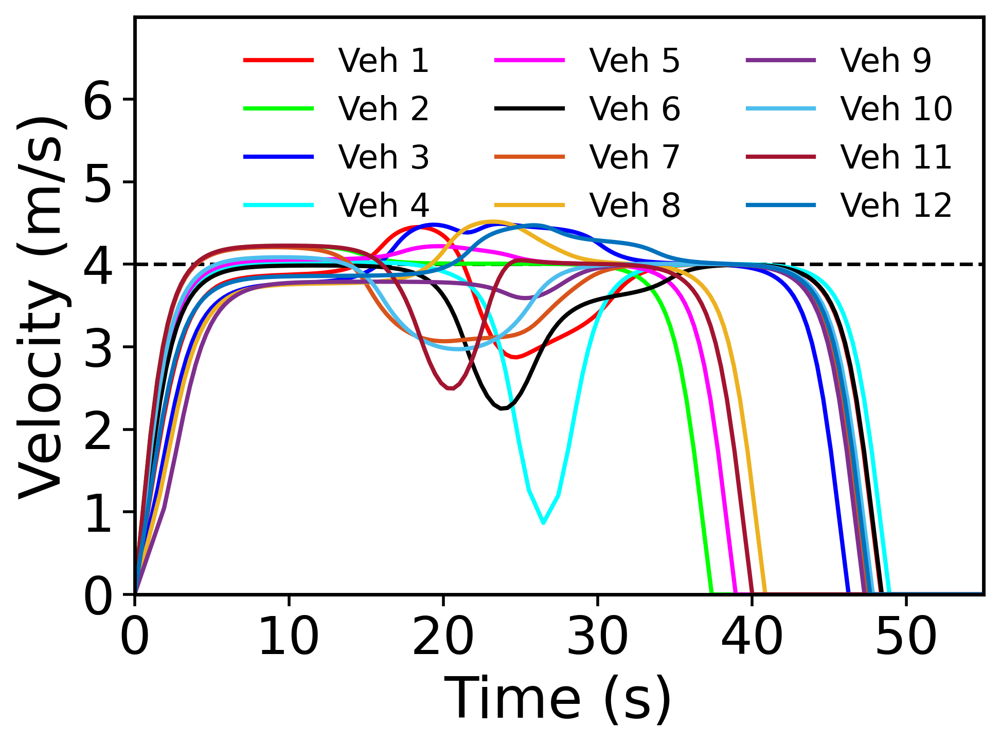<br>
<b>Random-Obstacle</b>
</td>
<td align="center" width="20%">
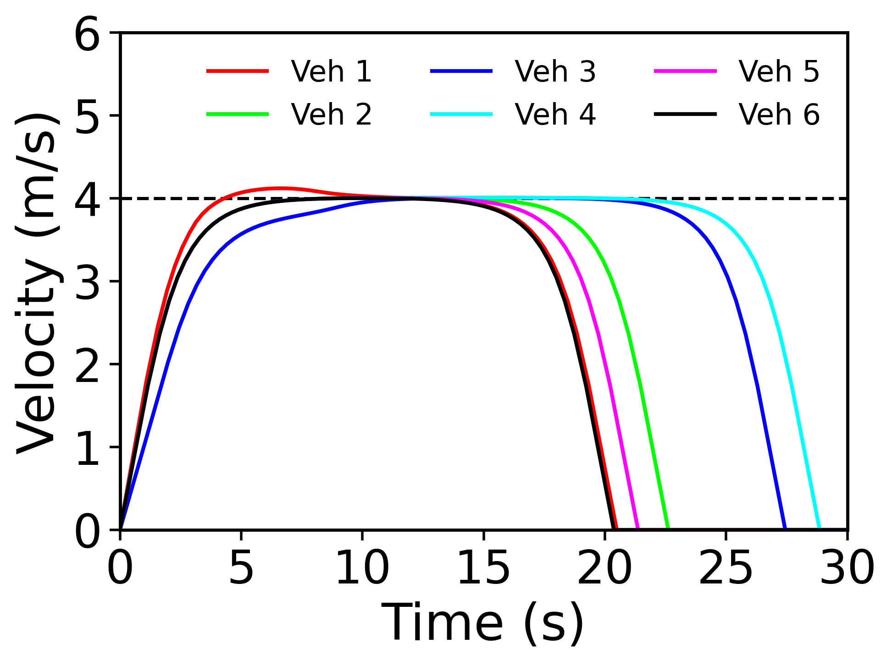<br>
<b>Intersection</b>
</td>
<td align="center" width="20%">
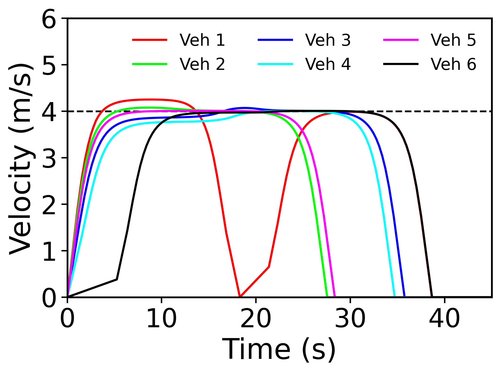<br>
<b>Narrow-Channel</b>
</td>
</tr>
</table>

The coordinated profiles reflect the conflict-zone passing orders and provide smooth, dynamically bounded velocity references for the local planning layer.

### Quantitative Comparison With Global Velocity-Coordination Baselines

**Comparison of global velocity coordination results across three scenarios.**

| Scenario | Algorithm | Success Rate (%) | Avg. Computation Time (s) | Avg. Total Velocity Cost |
|---|---|---:|---:|---:|
| Random-Obstacle | **Proposed (Global Velocity Layer)** | **100** | 0.11 | 1383.55 |
| Random-Obstacle | FIFO | 96 | **0.09** | **1307.32** |
| Random-Obstacle | FPSP | 4 | 0.57 | 1569.85 |
| Intersection | **Proposed (Global Velocity Layer)** | **100** | 0.02 | 554.86 |
| Intersection | FIFO | 98 | **0.01** | **548.84** |
| Intersection | FPSP | 80 | 0.06 | 573.71 |
| Narrow-Channel | **Proposed (Global Velocity Layer)** | **100** | 0.05 | 694.65 |
| Narrow-Channel | FIFO | **100** | **0.04** | **651.38** |
| Narrow-Channel | FPSP | 8 | 0.08 | 735.73 |

The proposed velocity layer is the only method that achieves a 100% success rate in all three scenarios. FIFO is slightly faster and yields a lower average velocity cost when it succeeds, but its fixed ordering causes failures in the Random-Obstacle and Intersection scenarios. FPSP is considerably less reliable in dense or geometrically constrained interactions. These results show that the proposed conflict-zone formulation improves robustness while retaining low computation time.

---

## 1.3 Reference-Guided Distributed Local Motion Planning

The local planner uses the globally coordinated spatiotemporal references as nominal guidance and replans independently for each UGV over a receding horizon. Convex safe spaces decouple inter-vehicle and obstacle-avoidance constraints, while the constraint-relaxed SQP solver supports rapid onboard optimization and handles short-term reference infeasibility caused by local disturbances or pop-up obstacles.

### Parameter Settings

**Table 6. Parameter settings for distributed local motion planning.**

| Symbol | Description | Value |
|---|---|---:|
| `L_w` | Wheelbase | 2.78 m |
| `L_b` | Vehicle width | 1.85 m |
| `L_f` | Front overhang | 0.915 m |
| `L_r` | Rear overhang | 0.915 m |
| `v_ref` | Reference velocity | 4 m/s |
| `v_min` | Minimum velocity | 0 m/s |
| `v_max` | Maximum velocity | 6 m/s |
| `a_t,max` | Maximum longitudinal acceleration | 3 m/s² |
| `a_n,max` | Maximum lateral acceleration | 3 m/s² |
| `delta_max` | Maximum steering angle | 30° |
| `alpha_max` | Maximum steering rate | 30°/s |
| `d_safety` | Safety clearance | 0.08 m |
| `n_p` | Prediction horizon length | 40 |
| `Delta t` | Sampling interval | 0.1 s |
| `N_SQP,max` | Maximum SQP iterations | 3 |

### Distributed Local Motion-Planning Demonstrations

<table>
<tr>
<td align="center" width="33%">
<br>
<b>Random-Obstacle Scenario</b><br>
Distributed replanning around irregular static obstacles and dense vehicle interactions.
</td>
<td align="center" width="33%">
<br>
<b>Intersection Scenario</b><br>
Onboard tracking and local adjustment of the coordinated intersection references.
</td>
<td align="center" width="33%">
<br>
<b>Narrow-Channel Scenario</b><br>
Locally executable motion generation inside a restricted bidirectional corridor.
</td>
</tr>
</table>

The dashed trajectories in the local-planning demonstrations denote the globally coordinated references, while the vehicle motions show the independently replanned trajectories generated onboard each UGV.

### Local Velocity and Front-Wheel Steering Profiles

<table>
<tr>
<td align="center" width="50%">
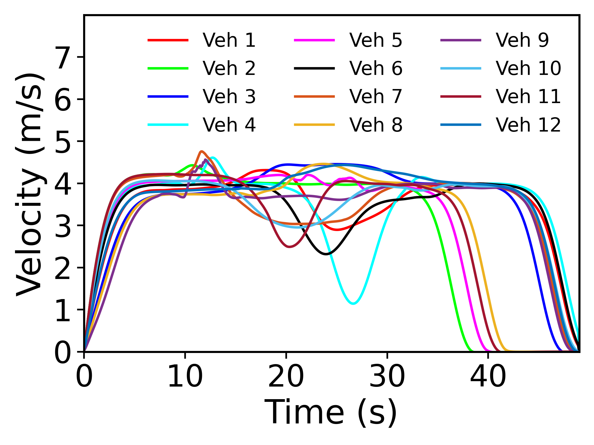<br>
<b>Random-Obstacle: velocity profiles</b>
</td>
<td align="center" width="50%">
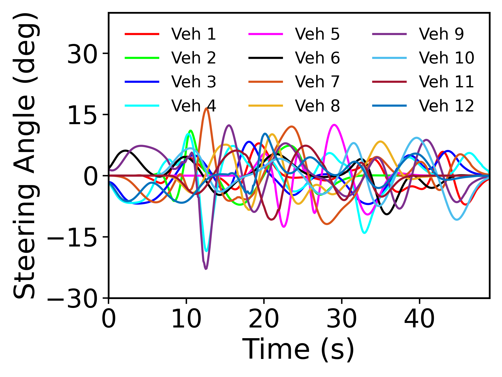<br>
<b>Random-Obstacle: front-wheel steering-angle profiles</b>
</td>
</tr>
<tr>
<td align="center" width="50%">
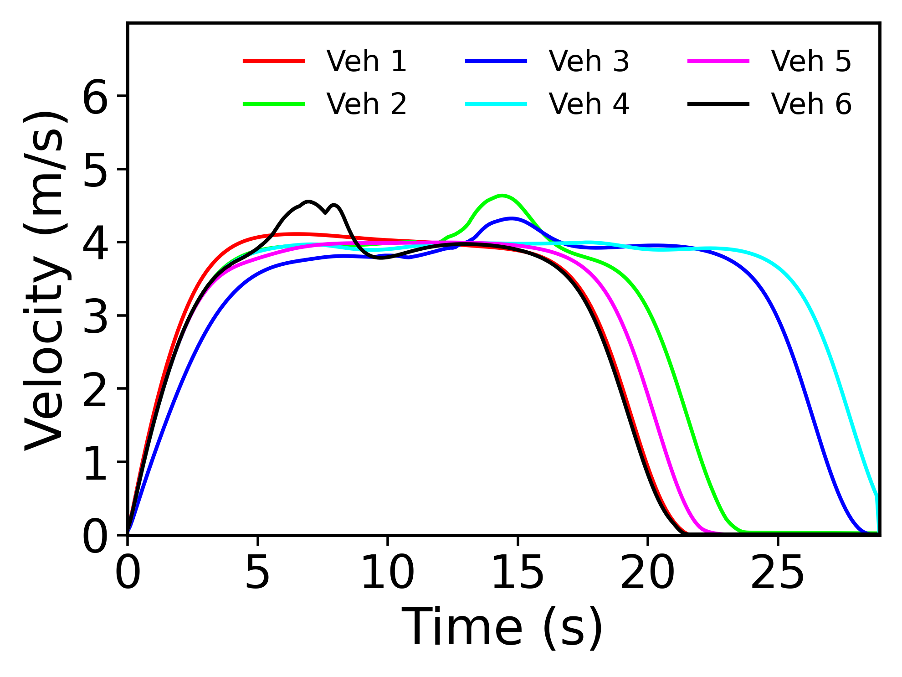<br>
<b>Intersection: velocity profiles</b>
</td>
<td align="center" width="50%">
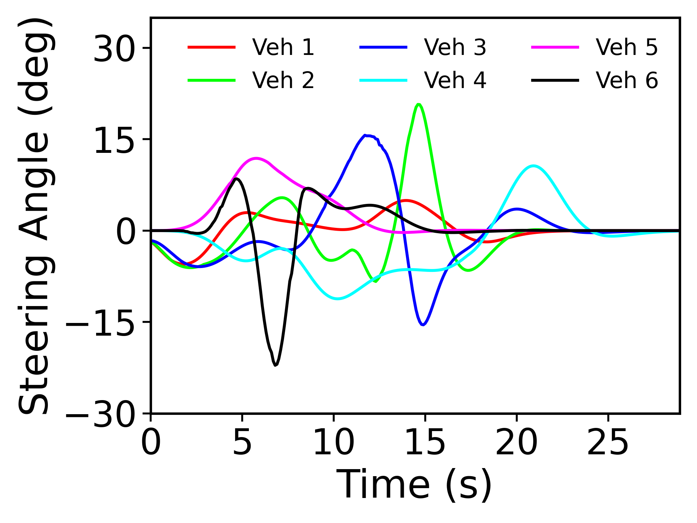<br>
<b>Intersection: front-wheel steering-angle profiles</b>
</td>
</tr>
<tr>
<td align="center" width="50%">
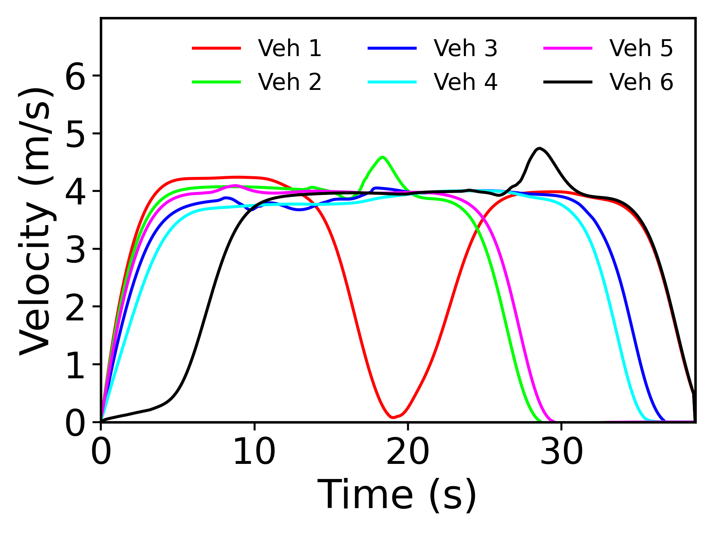<br>
<b>Narrow-Channel: velocity profiles</b>
</td>
<td align="center" width="50%">
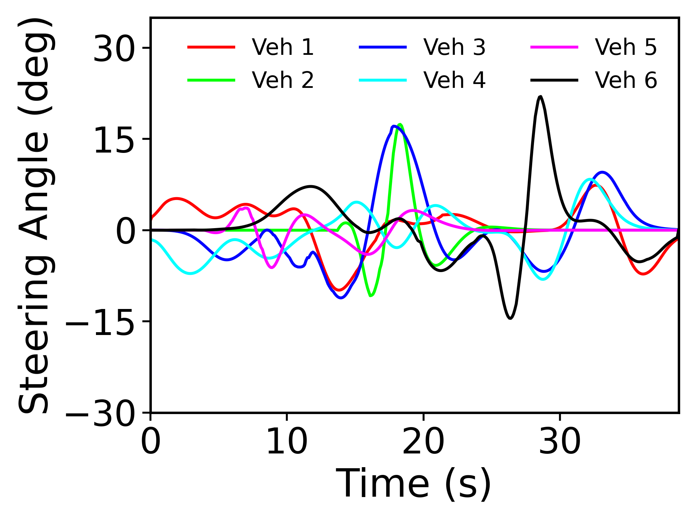<br>
<b>Narrow-Channel: front-wheel steering-angle profiles</b>
</td>
</tr>
</table>

The velocity profiles remain continuous during acceleration, interaction, and stopping, while the front-wheel steering commands stay bounded within the prescribed limits. The profiles also illustrate how the local planners introduce vehicle-specific adjustments while remaining guided by the globally coordinated references.

### Computation-Time Comparison

**Comparison of local motion planning results across three scenarios.**

| Scenario | Algorithm | Avg. Time (ms) | Max. Time (ms) | 99th Pct. Time (ms) |
|---|---|---:|---:|---:|
| Random-Obstacle | **Proposed (Local Layer)** | **12.9** | **56.4** | **37.2** |
| Random-Obstacle | Direct IPOPT | 58.2 | 1260.0 | 170.6 |
| Intersection | **Proposed (Local Layer)** | **9.3** | **34.6** | **22.4** |
| Intersection | Direct IPOPT | 39.2 | 332.8 | 93.1 |
| Narrow-Channel | **Proposed (Local Layer)** | **9.4** | **42.3** | **20.5** |
| Narrow-Channel | Direct IPOPT | 38.0 | 950.3 | 96.1 |

The proposed local planner consistently reduces average, maximum, and 99th-percentile solution times relative to direct IPOPT. The low tail latency is particularly important for stable receding-horizon execution on resource-constrained onboard processors.

### Collision-Constraint Slack Statistics

The slack variables are introduced only to preserve numerical feasibility when the globally coordinated references become temporarily incompatible with local collision-avoidance constraints. Their values remain substantially below the prescribed safety clearance of 0.08 m in all three scenarios.

**Table 7. Maximum collision-constraint slack for each UGV in the Random-Obstacle scenario.**

| UGV No. | 1 | 2 | 3 | 4 | 5 | 6 |
|---|---:|---:|---:|---:|---:|---:|
| Max. slack (m) | 0 | 0.003 | 0 | 0.005 | 0.007 | 0 |
| UGV No. | 7 | 8 | 9 | 10 | 11 | 12 |
| Max. slack (m) | 0.005 | 0.008 | 0.010 | 0 | 0.002 | 0.003 |

All 12 UGVs complete the multi-directional crossing task while adjusting their local motions around the obstacle-rich interaction region. The maximum collision-constraint slack is 0.010 m.

**Table 8. Maximum collision-constraint slack for each UGV in the Intersection scenario.**

| UGV No. | 1 | 2 | 3 | 4 | 5 | 6 |
|---|---:|---:|---:|---:|---:|---:|
| Max. slack (m) | 0 | 0.007 | 0.005 | 0 | 0 | 0.013 |

All six UGVs maintain continuous velocity and bounded steering responses through the shared intersection. The maximum collision-constraint slack is 0.013 m.

**Table 9. Maximum collision-constraint slack for each UGV in the Narrow-Channel scenario.**

| UGV No. | 1 | 2 | 3 | 4 | 5 | 6 |
|---|---:|---:|---:|---:|---:|---:|
| Max. slack (m) | 0.001 | 0.004 | 0.028 | 0 | 0.001 | 0.007 |

All six UGVs pass through the bidirectional constrained corridor while maintaining bounded velocity and steering responses. The maximum collision-constraint slack is 0.028 m. Thus, the largest slack observed across all reported runs remains below the 0.08 m safety clearance.

---

# 2. Real-Vehicle Experiments

The real-vehicle experiments evaluate the complete centralized–distributed framework on Ackermann-steered UGVs. For each scenario, the linked video shows the physical experiment, while the 3-D spatiotemporal trajectory, 2-D top-view trajectory, and measured velocity profiles provide complementary views of the executed vehicle motions.

## 2.1 Random-Obstacle Scenario

[▶ Watch the Random-Obstacle real-vehicle experiment](<Real-Vehicle Experiment：Random Obstacles.mp4>)

<table>
<tr>
<td align="center" width="40%">
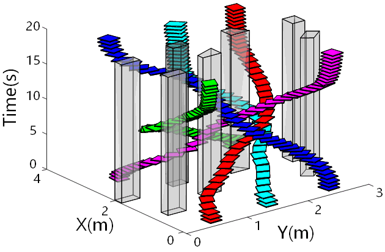<br>
<b>3-D spatiotemporal trajectories</b>
</td>
<td align="center" width="20%">
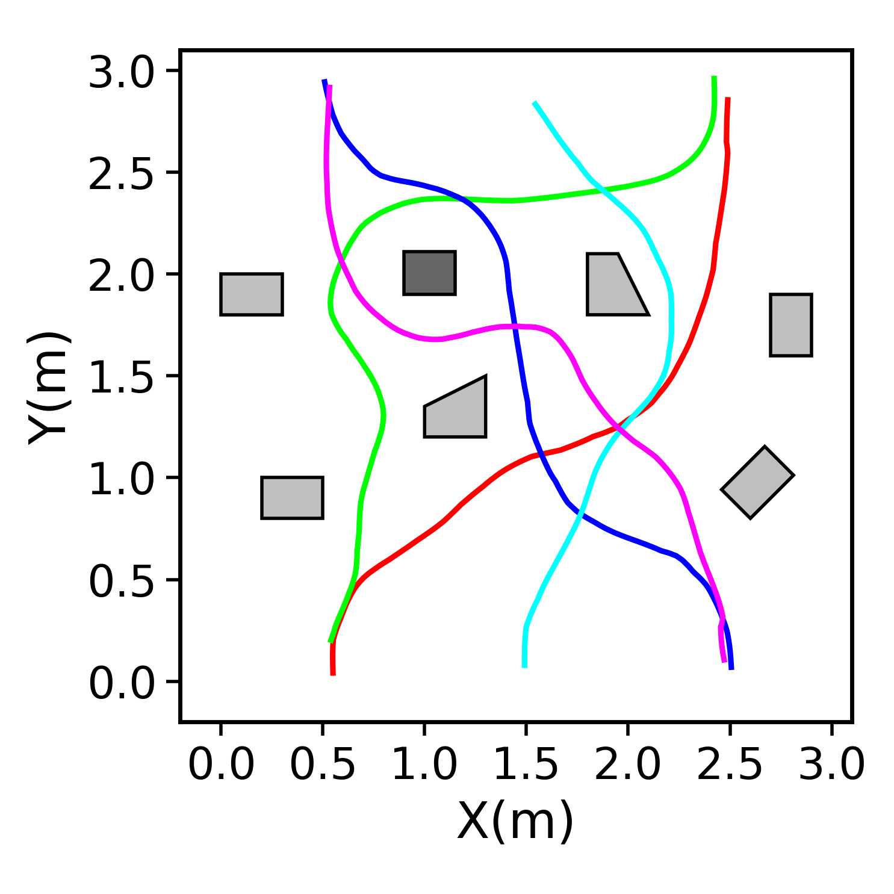<br>
<b>2-D top-view trajectories</b>
</td>
<td align="center" width="40%">
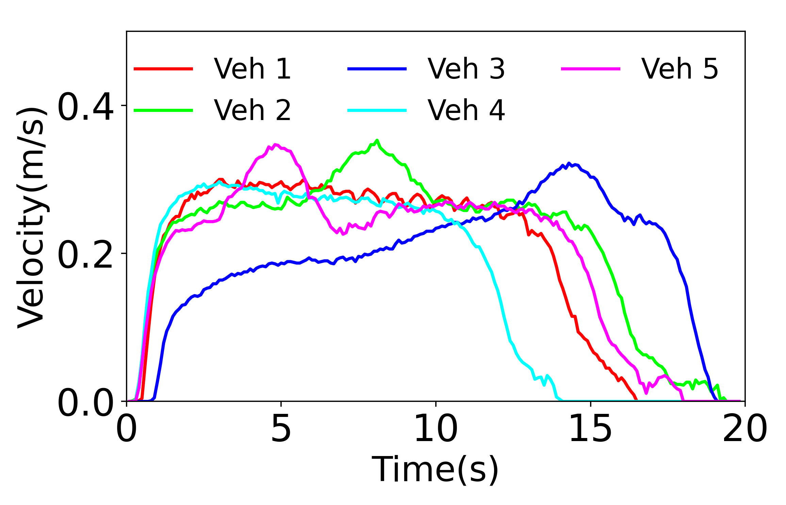<br>
<b>Measured velocity profiles</b>
</tr>
</table>


<!-- </p> -->

The 3-D trajectories visualize the temporal evolution of the vehicle motions, while the top-view trajectories show the spatial paths through the obstacle-rich environment. The measured velocity profiles complement the video by showing the executable speed evolution of the physical UGVs.

---

## 2.2 Intersection Scenario

[▶ Watch the Intersection real-vehicle experiment](<Real-Vehicle Experiment：Intersection.mp4>)

<table>
<tr>
<td align="center" width="50%">
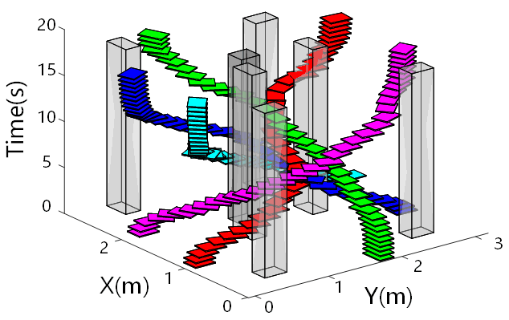<br>
<b>3-D spatiotemporal trajectories</b>
</td>
<td align="center" width="25%">
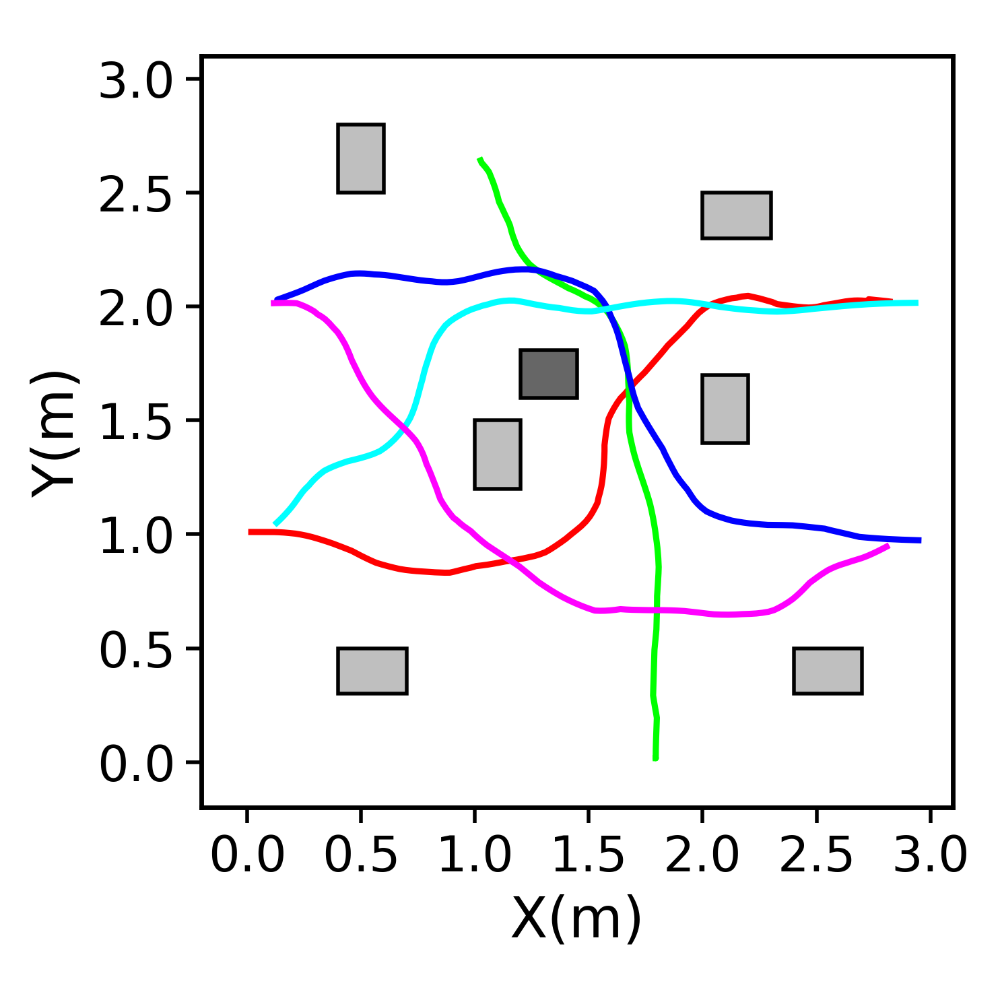<br>
<b>2-D top-view trajectories</b>
</td>
</tr>
</table>

<td align="center" width="25%">
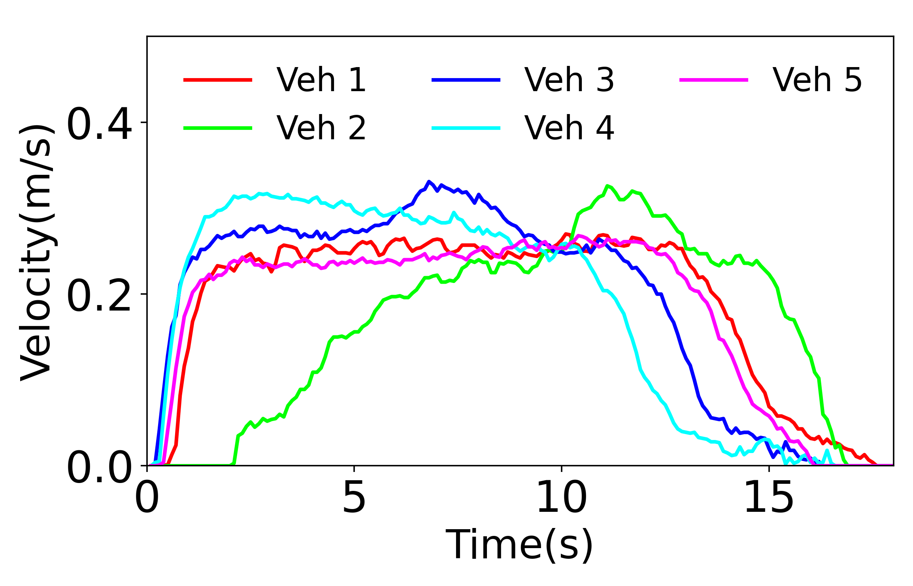<br>
<b>Measured velocity profiles</b>
</p>

The trajectory plots show how the vehicles execute the coordinated passing order through the shared intersection. The measured velocity profiles provide the corresponding temporal motion information during the physical experiment.

---

## 2.3 Narrow-Channel Scenario

[▶ Watch the Narrow-Channel real-vehicle experiment](<Real-Vehicle Experiment：Narrow Channel.mp4>)

<table>
<tr>
<td align="center" width="50%">
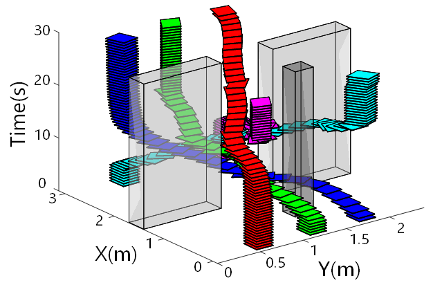<br>
<b>3-D spatiotemporal trajectories</b>
</td>
<td align="center" width="25%">
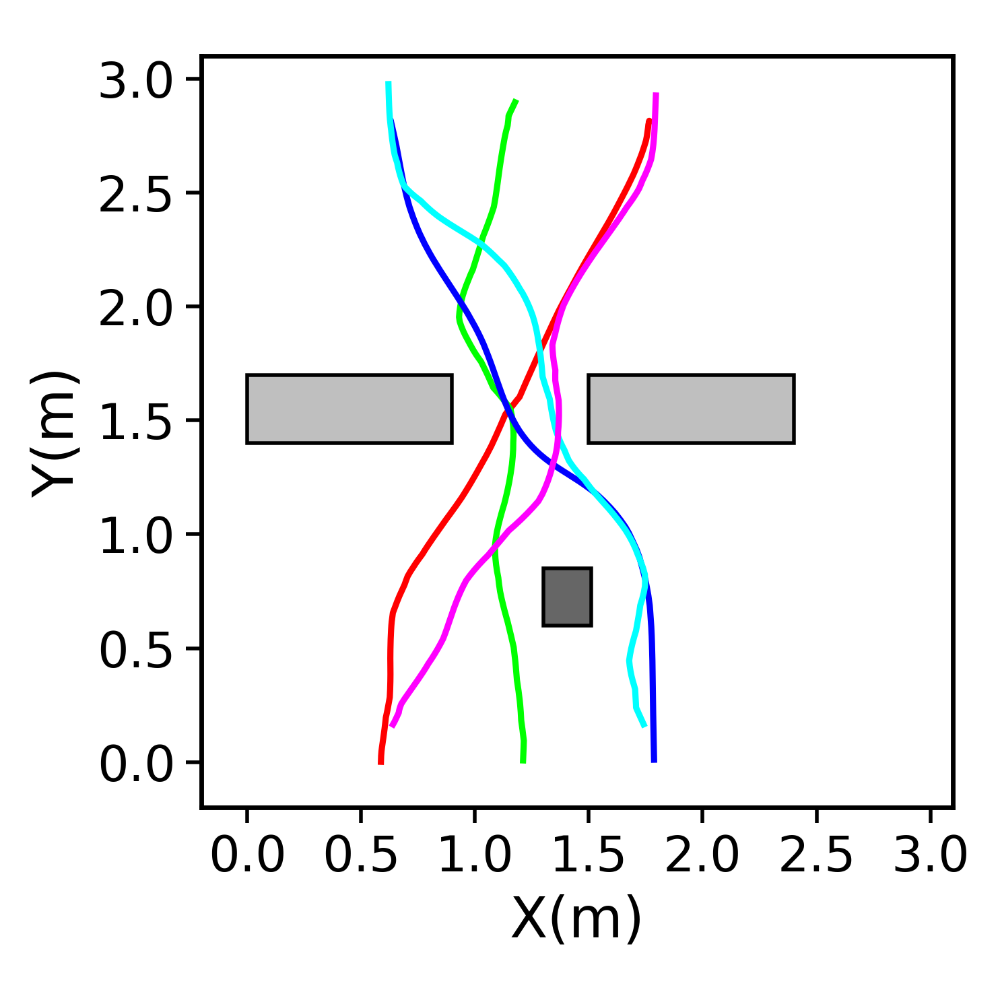<br>
<b>2-D top-view trajectories</b>
</td>
</tr>
</table>

<td align="center" width="25%">
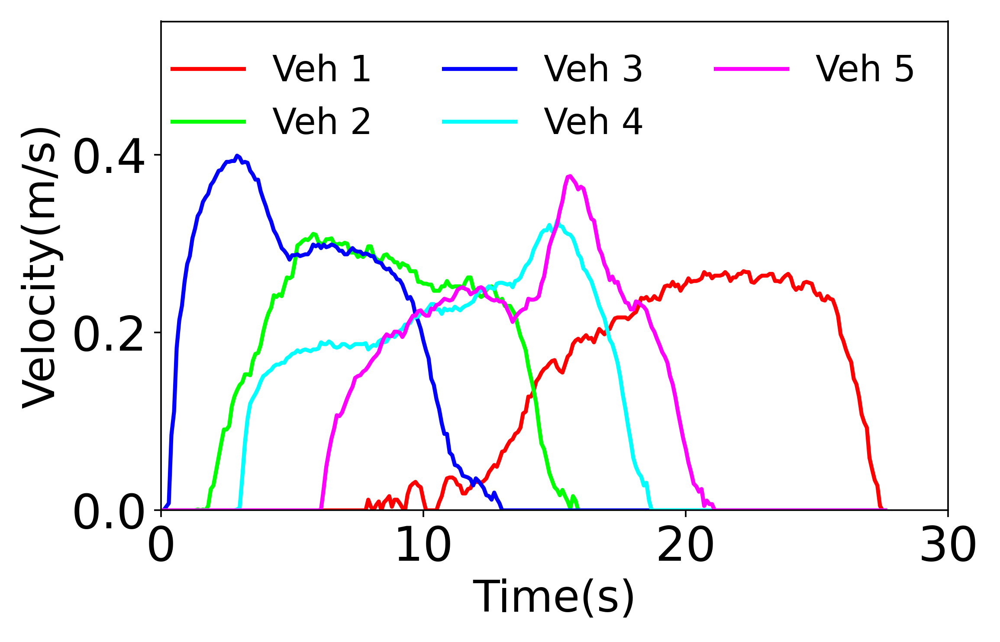<br>
<b>Measured velocity profiles</b>
</p>

The 3-D and 2-D trajectories show the coordinated bidirectional traversal of the constrained passage. The measured velocity profiles illustrate the speed adjustments required to maintain safe and executable motion in the narrow environment.

---

# 3. File Organization

```text
.
├── figs/
│   ├── fig1.png, fig3.png, fig5.png    # Global path-layer velocity profiles
│   ├── fig2.png, fig4.png, fig6.png    # Global velocity-coordination profiles
│   ├── fig7.png ... fig12.png          # Local velocity and steering profiles
│   ├── fig13.png ... fig18.png         # Real-vehicle 3-D and 2-D trajectories
│   └── fig19.png ... fig21.png         # Real-vehicle velocity profiles
├── Global_path_planning_*.gif
├── Global_velocity_coordination_*.gif
├── Local_motion_planning_*.gif
├── Real-Vehicle Experiment：Random Obstacles.mp4
├── Real-Vehicle Experiment：Intersection.mp4
└── Real-Vehicle Experiment：Narrow Channel.mp4
```

This repository is intended as an experimental supplement to the paper. The simulation section follows the three-layer algorithmic structure of the proposed framework, while the real-vehicle section reports the complete system-level execution results. The GIFs and videos provide representative visual demonstrations, and the tables and plotted profiles provide the parameter settings, comparative results, ablation evidence, motion characteristics, computation times, and safety-related statistics needed to interpret the experiments.
